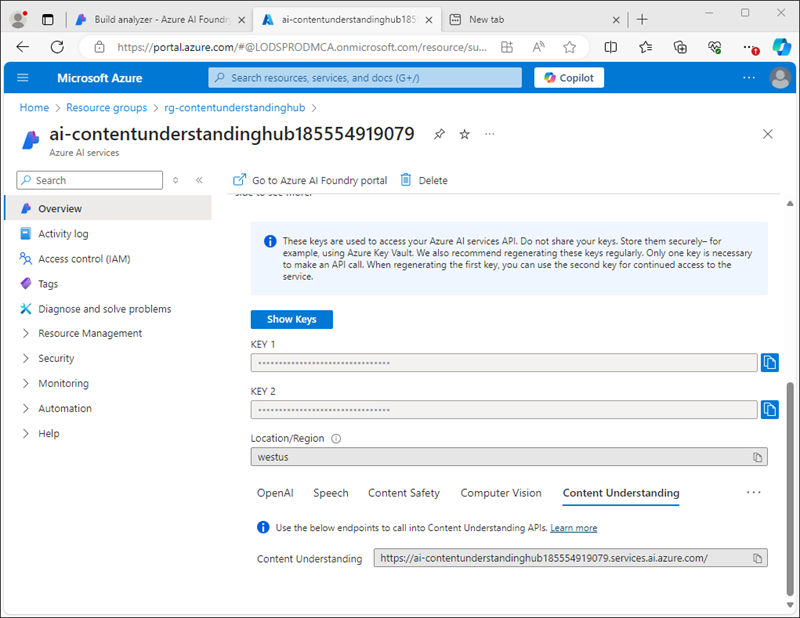

---
lab:
  title: تحليل المحتوى باستخدام Azure AI Content Understanding
  module: Multimodal analysis with Content Understanding
---

# تحليل المحتوى باستخدام Azure AI Content Understanding

في هذا التمرين، يمكنك استخدام مدخل Azure AI Foundry لإنشاء مشروع فهم المحتوى الذي يمكنه استخراج المعلومات من نماذج سياسة التأمين على السفر. ثم ستختبر محلل محتواك في مدخل Azure AI Foundry وتستخدمه من خلال واجهة Content Understanding REST.

سيستغرق هذا التدريب حوالي **30** دقيقة.

## إنشاء مشروع "فهم المحتوى"

لنبدأ باستخدام مدخل Azure AI Foundry لإنشاء مشروع "فهم المحتوى".

1. في متصفح الويب، افتح [مدخل Azure AI Foundry](https://ai.azure.com) على `https://ai.azure.com` وسجّل الدخول باستخدام بيانات اعتماد Azure الخاصة بك.

    تبدو الصفحة الرئيسية لمدخل Azure AI Foundry مشابهة للصورة التالية:

    

1. في قسم **العثور عليه بسرعة** من الصفحة الرئيسية، نحو الأسفل، حدد **فهم المحتوى**.
1. في صفحة **فهم المحتوى**، حدد زر **إنشاء مشروع "فهم محتوى" جديد**.
1. في خطوة **نظرة عامة على المشروع**، اضبط الخصائص التالية لمشروعك؛ ثم حدد **التالي**:
    - **اسم المشروع**: `travel-insurance`
    - **الوصف**: `Insurance policy data extraction`
    - **المركز**: إنشاء مركز جديد
1. في خطوة **إنشاء مركز**، اضبط الخصائص التالية ثم حدد **التالي**:
    - **مورد مركز الذكاء الاصطناعي في Azure**: `content-understanding-hub`
    - **اشتراك Azure**: *حدد اشتراكك Azure*
    - **مجموعة الموارد**: *إنشاء مجموعة موارد جديدة باسم مناسب*
    - **الموقع**: *حدد أي موقع متاح*
    - **خدمات الذكاء الاصطناعي في Azure**: *إنشاء مورد جديد لخدمات الذكاء الاصطناعي في Azure باسم مناسب*
1. في خطوة **إعدادات التخزين**، حدّد حساب تخزين مركز الذكاء الاصطناعي جديدًا وحدد **التالي**.
1. في صفحة **المراجعة**، حدّد **إنشاء مشروع**. ثم انتظر حتى يتم إنشاء المشروع والموارد المرتبطة به.

    عندما يكون المشروع جاهزًا، سيتم فتحه في صفحة **تعريف المخطط**.

    

## مراجعة موارد Azure

عند إنشاء مركز الذكاء الاصطناعي والمشروع، تم إنشاء موارد مختلفة في اشتراك Azure الخاص بك لدعم المشروع.

1. في علامة تبويب المتصفح الجديدة، افتح [بوابة Azure](https://portal.azure.com) على `https://portal.azure.com`؛ وسجّل الدخول باستخدام بيانات اعتماد Azure الخاصة بك.
1. انتقل إلى مجموعة الموارد التي قمت بإنشائها لمركزك، ولاحظ موارد Azure التي تم إنشاؤها.

    

## تعريف مخطط مخصص

ستقوم ببناء محلل يمكنه استخراج المعلومات من نماذج التأمين على السفر. ستبدأ بتعريف مخطط استنادًا إلى نموذج عينة.

1. قم بتنزيل نموذج العينة [train-form.pdf](https://github.com/microsoftlearning/mslearn-ai-document-intelligence/raw/main/Labfiles/05-content-understanding/forms/train-form.pdf) من `https://github.com/microsoftlearning/mslearn-ai-document-intelligence/raw/main/Labfiles/05-content-understanding/forms/train-form.pdf` واحفظه في مجلد محلي.
1. ارجع إلى علامة تبويب المتصفح التي تحتوي على مشروع "فهم المحتوى" الخاص بك، وفي صفحة **تعريف المخطط**، قم بتحميل الملف **train-form.pdf** الذي قمت بتنزيله للتو.
1. حدد قالب **تحليل المستند**، ثم حدد **إنشاء**.

    يوفر محرر المخطط طريقة لتحديد حقول البيانات التي سيتم استخراجها من النموذج، والذي يظهر على اليمين. يبدو النموذج بهذا الشكل:

    

    تتكون حقول البيانات في النموذج من:
    
    - مجموعة من التفاصيل الشخصية المتعلقة بحامل الوثيقة.
    - مجموعة من التفاصيل المتعلقة بالرحلة التي يلزم تأمينها.
    - توقيع وتاريخ

    سنبدأ بإضافة حقل يمثل التفاصيل الشخصية كجدول، والذي سنحدد فيه بعد ذلك حقولًا فرعية للتفاصيل الفردية.

1. حدد **+ إضافة حقل جديد** وأنشئ حقل جديد بالقيم التالية:
    - **اسم الحقل**: `PersonalDetails`
    - **وصف الحقل**: `Policyholder information`
    - **نوع القيمة**: جدول
1. حدد **حفظ التغييرات** (&#10004;) ولاحظ أنه سيتم إنشاء حقل فرعي جديد تلقائيًا.
1. تكوين الحقل الفرعي الجديد بالقيم التالية:
    - **اسم الحقل**: `PolicyholderName`
    - **وصف الحقل**: `Policyholder name`
    - **نوع القيمة**: سلسلة
    - **الأسلوب**: استخراج
1. استخدم الزر **+ إضافة حقل فرعي جديد** لإضافة الحقول الفرعية الإضافية التالية:

    | اسم الحقل | وصف الحقل | نوع القيمة | الأسلوب |
    |--|--|--|--|
    | `StreetAddress` | `Policyholder address` | السلسلة‬ | الاستخراج |
    | `City` | `Policyholder city` | السلسلة‬ | الاستخراج |
    | `PostalCode` | `Policyholder post code` | السلسلة‬ | الاستخراج |
    | `CountryRegion` | `Policyholder country or region` | السلسلة‬ | الاستخراج |
    | `DateOfBirth` | `Policyholder birth date` | التاريخ | الاستخراج |

1. عند الانتهاء من إضافة كافة الحقول الفرعية للتفاصيل الشخصية، استخدم زر **الرجوع** للعودة إلى المستوى الأعلى من المخطط.
1. أضف حقل *جدول* جديد باسم **`TripDetails`** لتمثيل تفاصيل الرحلة المؤمنة. ثم أضف إليه الحقول الفرعية التالية:

    | اسم الحقل | وصف الحقل | نوع القيمة | الأسلوب |
    |--|--|--|--|
    | `DestinationCity` | `Trip city` | السلسلة‬ | الاستخراج |
    | `DestinationCountry` | `Trip country or region` | السلسلة‬ | الاستخراج |
    | `DepartureDate` | `Date of departure` | التاريخ | الاستخراج |
    | `ReturnDate` | `Date of return` | التاريخ | الاستخراج |

1. ارجع إلى المستوى الأعلى للمخطط وأضف الحقلين الفرديين التاليين:

    | اسم الحقل | وصف الحقل | نوع القيمة | الأسلوب |
    |--|--|--|--|
    | `Signature` | `Policyholder signature` | السلسلة‬ | الاستخراج |
    | `Date` | `Date of signature` | التاريخ | الاستخراج |

1. تحقق من أن المخطط المكتمل يبدو كما يلي، ثم احفظه.

    

1. في صفحة **محلل الاختبار**، إذا لم يبدأ التحليل تلقائيًا، فحدد **تشغيل التحليل**. ثم انتظر حتى اكتمال التحليل وراجع قيم النص في النموذج التي تم تحديدها على أنها تطابق الحقول في المخطط.

    

    يجب أن تكون خدمة "فهم المحتوى" قد حددت بشكل صحيح النص الذي يتوافق مع الحقول الموجودة في المخطط. إذا لم يتم ذلك، فيمكنك استخدام صفحة **بيانات الوصف** لتحميل نموذج عينة آخر وتحديد النص الصحيح لكل حقل بشكل صريح.

## إنشاء محلل واختباره

الآن بعد أن قمت بتدريب نموذج لاستخراج الحقول من نماذج التأمين، يمكنك إنشاء محلل لاستخدامه مع نماذج مماثلة.

1. في جزء التنقل الموجود على اليسار، حدد صفحة **إنشاء محلل**.
1. حدد **+ إنشاء محلل** وأنشئ محللًا جديدًا بالخصائص التالية (مكتوب بالضبط كما هو موضح هنا):
    - **الاسم:** `travel-insurance-analyzer`
    - **الوصف**: `Insurance form analyzer`
1. انتظر حتى يصبح المحلل الجديد جاهزًا (استخدم زر **تحديث** للتحقق).
1. قم بتنزيل [test-form.pdf](https://github.com/microsoftlearning/mslearn-ai-document-intelligence/raw/main/Labfiles/05-content-understanding/forms/test-form.pdf) من `https://github.com/microsoftlearning/mslearn-ai-document-intelligence/raw/main/Labfiles/05-content-understanding/forms/test-form.pdf` واحفظه في مجلد محلي.
1. ارجع إلى صفحة **إنشاء محلل** وحدد رابط **محلل تأمين السفر**. سيتم عرض الحقول المحددة في مخطط المحلل.
1. في صفحة **محلل تأمين السفر**، حدد **اختبار**.
1. استخدم الزر **+ تحميل ملفات الاختبار** لتحميل **test-form.pdf** وتشغيل التحليل لاستخراج بيانات الحقل من نموذج الاختبار.

    

1. اعرض علامة التبويب **النتيجة** لرؤية النتائج بتنسيق JSON التي أعادها المحلل. في المهمة التالية، ستستخدم واجهة برمجة تطبيقات Content Understanding REST لإرسال نموذج إلى المحلل الخاص بك وإرجاع النتائج بهذا التنسيق.
1. أغلق صفحة **محلل-تأمين-السفر**.

## استخدم واجهة برمجة تطبيقات Content Understanding REST

الآن بعد أن قمت بإنشاء محلل، يمكنك استخدامه من خلال تطبيق عميل عبر واجهة برمجة تطبيقات Content Understanding REST.

1. انتقل إلى علامة تبويب المتصفح التي تحتوي على بوابة Azure (أو افتح `https://portal.azure.com` في علامة تبويب جديدة إذا قمت بإغلاقها).
1. في مجموعة الموارد الخاصة بمركز فهم المحتوى الخاص بك، افتح مورد **خدمات الذكاء الاصطناعي في Azure**.
1. في صفحة **نظرة عامة**، في قسم **المفاتيح ونقطة النهاية**، اعرض علامة التبويب **فهم المحتوى**.

    

    ستحتاج إلى نقطة نهاية "فهم المحتوى" وأحد المفاتيح للاتصال بالمحلل الخاص بك من خلال تطبيق العميل.

1. استخدم الزر **[\>_]** الموجود على يمين شريط البحث أعلى الصفحة لإنشاء Cloud Shell جديد في بوابة Azure، وتحديد بيئة ***PowerShell***. يوفر shell السحابي واجهة سطر أوامر في جزء أسفل مدخل Microsoft Azure، كما هو موضح هنا:

    

    > **ملاحظة**: إذا كنت قد أنشأت مسبقًا Cloud Shell يستخدم بيئة *معالج Bash*، فبدّل إلى ***PowerShell***.

1. لاحظ أنه يمكنك تغيير حجم Cloud Shell عن طريق سحب شريط الفاصل في أعلى الجزء، أو عن طريق استخدام الرموز **—** و **◻** و**X** في أعلى يمين الجزء للتصغير والتكبير وإغلاق الجزء. لمزيد من المعلومات حول استخدام Azure Cloud Shell، راجع [وثائق Azure Cloud Shell](https://docs.microsoft.com/azure/cloud-shell/overview).
1. في شريط أدوات Cloud Shell، في قائمة **الإعدادات**، حدد **الانتقال إلى الإصدار الكلاسيكي** (هذا مطلوب لاستخدام محرر التعليمات البرمجية).

1. في جزء PowerShell، أدخل الأوامر التالية لاستنساخ مستودع GitHub لهذا التمرين:

    ```
    rm -r mslearn-ai-doc -f
    git clone https://github.com/microsoftlearning/mslearn-ai-document-intelligence mslearn-ai-doc
    ```

1. بعد استنساخ المستودع، انتقل إلى المجلد **mslearn-ai-doc/Labfiles/05-content-understanding/code**:

    ```
    cd mslearn-ai-doc/Labfiles/05-content-understanding/code
    ```

1. أدخل الأمر التالي لتحرير ملف التعليمات البرمجية **analyze_doc.py** لـ Python الذي تم توفيره:

    ```
    code analyze_doc.py
    ```
    يتم فتح ملف التعليمات البرمجية Python في محرر التعليمات البرمجية:

    

1. في ملف التعليمات البرمجية، استبدل العنصر النائب **\<CONTENT_UNDERSTANDING_ENDPOINT\>** بنقطة نهاية "فهم المحتوى" لديك، والعنصر النائب **\<CONTENT_UNDERSTANDING_KEY\>** بأحد المفاتيح لمورد خدمات الذكاء الاصطناعي في Azure لديك.

    > **تلميح**: ستحتاج إلى تغيير حجم نافذة Cloud Shell أو تصغيرها لنسخ نقطة النهاية والمفتاح من صفحة موارد خدمات الذكاء الاصطناعي في Azure في بوابة Azure - احرص على عدم *إغلاق* Cloud Shell (أو ستحتاج إلى تكرار الخطوات المذكورة أعلاه)

1. بعد استبدال العناصر النائبة، استخدم الأمر **CTRL+S** لحفظ التغييرات ثم مراجعة التعليمات البرمجية المكتملة، والتي:
    - jرسل طلب HTTP POST إلى نقطة نهاية "فهم المحتوى" لديك، مما يعطي تعليمات لـ **محلل-تأمين-السفر** بتحليل نموذج استنادًا إلى عنوان URL الخاص به.
    - يتحقق من الاستجابة لعملية POST لاسترداد مُعرّف لعملية التحليل.
    - ترسل طلب HTTP GET بشكل متكرر إلى خدمة Content Understanding حتى تتوقف العملية عن التشغيل.
    - إذا نجحت العملية، يتم عرض استجابة JSON.
1. استخدم الأمر **CTRL+Q** لإغلاق محرر التعليمات البرمجية مع إبقاء سطر أوامر Cloud Shell مفتوحًا.
1. في جزء سطر أوامر Cloud Shell، أدخل الأمر التالي لتثبيت مكتبة **الطلبات** الخاصة بـ Python (التي تستخدم في التعليمات البرمجية):

    ```
    pip install requests
    ```

1. بعد تثبيت المكتبة، في جزء سطر أوامر Cloud Shell، أدخل الأمر التالي لتشغيل التعليمات البرمجية لـ Python:

    ```
    python analyze_doc.py
    ```

1. راجع مخرجات البرنامج، والتي تتضمن نتائج JSON لتحليل المستندات.

    > **تلميح**: قد لا يكون المخزن المؤقت للشاشة في وحدة تحكم Cloud Shell كبيرًا بما يكفي لإظهار الناتج بأكمله. إذا كنت ترغب في مراجعة الناتج بأكمله، فشغّل البرنامج باستخدام الأمر `python analyze_doc.py > output.txt`. بعد ذلك، عند انتهاء البرنامج، استخدم الأمر `code output.txt` لفتح الناتج في محرر التعليمات البرمجية.

## تنظيف

إذا انتهيت من العمل باستخدام خدمة "فهم المحتوى"، فيجب عليك حذف الموارد التي قمت بإنشائها في هذا التمرين لتجنب تكبد تكاليف Azure غير الضرورية.

1. في مدخل Azure AI Foundry، انتقل إلى مشروع **تأمين-السفر** واحذفه.
1. في بوابة Azure، انتقل إلى مجموعة الموارد التي أنشأتها لهذه التدريبات.

